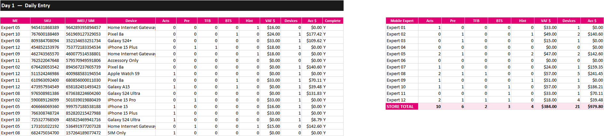
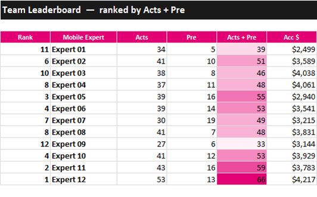

# Store Performance Tracker

The daily performance tracker I built and ran for a T-Mobile retail store — rebuilt here
as a clean, reproducible version. One row per transaction, one tab per day, rolling up to
per-expert totals, a team leaderboard, and month-to-goal tracking.

> **The data in this workbook is mock.** No real employees, customers, device IDs, or
> store numbers. The structure, the metrics, and the formulas are the real thing.

## The problem it solves

A retail store generates a few hundred transactions a week across a dozen people, and the
questions a manager needs answered are always the same: *who's tracking, what's slipping,
are we going to make goal this month?* Getting there means someone has to log every sale
and roll it up — reliably, every day, without a spreadsheet that quietly breaks.

## What was wrong with the version I was running

Working from the original file, two things stood out:

**1. A lookup column that failed everywhere.** The `AAL` column returned `#N/A` in
**403 cells** — 13 people × 31 days, every row of every tab. One broken formula,
replicated across the entire month.

**2. Device names were free text.** The same phone got entered a dozen different ways —
`IPOHNE 13`, `WATH7`, `gALAZY A15`, `galaxy utra 24`, `phone15`, `siim`. Harmless while
you're typing; fatal the moment you want to count anything by device.

Plus merged header bands that broke sorting and filtering, and a per-expert summary block
that had to be kept in sync by hand.

## What this version does differently

**Nothing can return `#N/A`.** Every roll-up is `SUMIF` or a 3-D `SUM`, and every division
is wrapped in `IFERROR`. Verified in Excel: **0 error cells across all 36 tabs.**

**Device and Mobile Expert are dropdowns**, driven by a Setup tab. A device can only be
entered one way — which is what makes device-level analysis possible at all. This is the
change that mattered most.

**One clean header row**, so every column sorts and filters and formulas survive an
inserted row.

**The per-expert summary computes itself** from the entry table, with a store total
underneath. Nothing to reconcile.

## What's in it

| Tab | What it answers |
|---|---|
| **Dashboard** | Where are we this month? KPI cards + daily trend |
| **Team Leaderboard** | Who's carrying it? `RANK` by Acts + Pre, color-scaled |
| **Daily Trend** | Which days ran hot or cold? Heatmap across all eight metrics |
| **Store Total** | Are we going to make goal? Month-to-date vs goal, % to goal, gap |
| **Setup** | Roster, device catalog, monthly goals — drives every dropdown and roll-up |
| **1 – 31** | Daily entry |

## Using it

1. Open **Setup** — replace the roster, adjust the device catalog, set monthly goals.
   Everything downstream follows automatically.
2. Log transactions on the numbered day tabs, one row per item.
3. Read Dashboard, Leaderboard, and Store Total. They update live.

Download [`Store_Performance_Tracker.xlsx`](Store_Performance_Tracker.xlsx) to open it in
Excel, or upload it to Google Drive — it converts to Sheets cleanly.

## Limitations & next

Mock data, so the numbers demonstrate the mechanics rather than a real month. Business-day
logic is simplified. Next: a month-over-month comparison tab, and pace-to-goal (are we on
track as of day *n*) rather than only end-of-month attainment.

## Skills demonstrated

Spreadsheet engineering (multi-sheet 3-D references, `SUMIF` roll-ups, `RANK`, `IFERROR`) ·
data validation and input design · conditional formatting · KPI definition · dashboard
design · designing a tool other people have to use every day.
