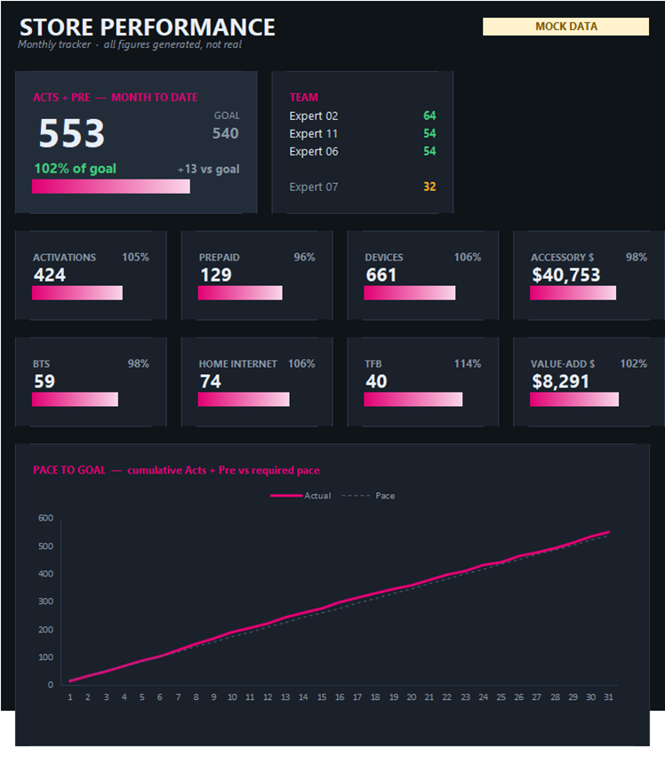
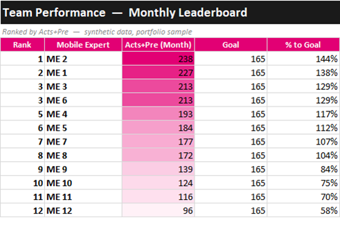
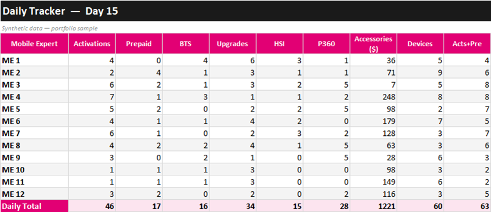
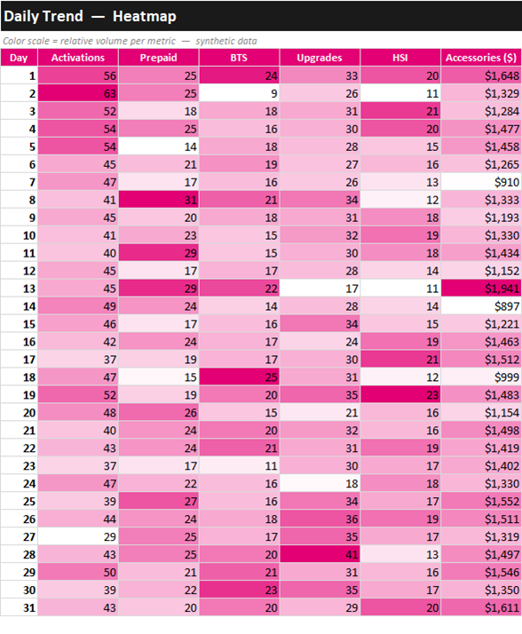

# T-Mobile Store Performance Dashboard

A monthly performance dashboard I built in Excel to run my retail store's numbers —
daily activations, prepaid, business (BTS), upgrades, devices, accessories, and home
internet — across a 12-person sales team, and roll the whole month up into something
a manager can read in ten seconds.

> **Note on the data:** This is the public, portfolio version of the tool. Every name
> and number in this repo is **synthetic sample data** — no real employees, customers,
> store numbers, or device IDs. The structure, formulas, and design are the real thing;
> the data is made up on purpose to keep everyone's information private.

## What I built

A single Excel workbook — 35 tabs — that handles a full month end to end:

- **31 daily entry sheets** (one per day) where each of 12 mobile experts logs their sales
- **A Store Total tab** that rolls every day up with live multi-sheet formulas and tracks month-to-goal
- **A Dashboard** with KPI cards and a daily trend chart
- **A Team Performance leaderboard** that ranks the team automatically
- **A Daily Trend heatmap** to spot hot and cold days at a glance

## The backstory

The tracker I inherited wasn't holding up. Formulas that broke as the month went on and
totals you couldn't fully rely on — so the team didn't really use it. I rebuilt it from
the ground up: fixed the references, made the daily and monthly totals reliable, and
added month-to-goal tracking so the store could see where it stood day to day.

## What it changed

I rolled the rebuilt tracker out on the floor. The store was already performing well —
what changed is that the team finally had numbers they could trust to hold that, instead
of a tracker nobody opened because it didn't add up.

For this portfolio version I also built the manager-facing layer I think every store
tracker should have on top of it — a KPI dashboard, an auto-ranking team leaderboard,
and a day-by-day heatmap. The leaderboard is the part the team always cares about most:
it updates straight from the daily sheets and ranks everyone by Acts+Pre, with a color
scale so the standings are obvious.

## How it works

Every daily sheet feeds the summary tabs through formulas — no copy-paste, no manual
retotaling. Change one number on Day 15 and the Dashboard, leaderboard, and heatmap all
move with it.

A daily entry sheet (totals auto-calculated at the bottom):

The Daily Trend tab turns the month into a heatmap — each metric gets its own color
scale, so a slow day or a hot streak jumps right out:

Under the hood:
- 3-D / multi-sheet references (`=SUM('1:31'!J16)`) to total across all 31 days
- `RANK()` for the self-sorting leaderboard
- Conditional-formatting color scales for the heatmaps
- A line chart driven straight off the daily totals

## How to view

Two options:
1. **Download the workbook** — grab [`Store_Performance_Dashboard.xlsx`](Store_Performance_Dashboard.xlsx)
   and open it in Excel. It recalculates live, so change any daily number and watch the
   dashboard update.
2. **Just look at the screenshots** in the [`screenshots/`](screenshots) folder (also
   embedded above) if you don't have Excel handy.

## Skills demonstrated

- **Excel** — advanced formulas, conditional formatting, charts, and multi-sheet references
- **Data cleaning** — took an unreliable workbook and made its numbers trustworthy
- **Dashboard design** — KPI cards, leaderboard, and heatmap built for a non-technical audience
- **KPI definition** — picked and defined the metrics that actually move a retail store
- **Stakeholder communication** — turned raw daily entries into something a team and a district can read at a glance

---

*Built with synthetic data for portfolio use. The original was deployed on a real
T-Mobile retail floor; this version exists to show the work without exposing anyone's
information.*
